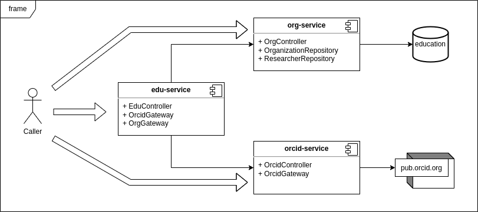
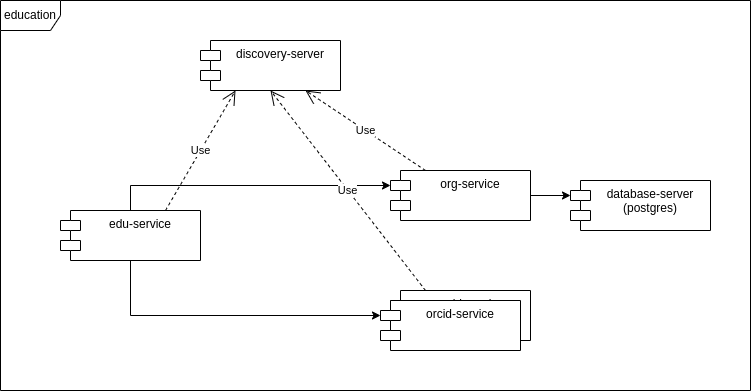

# education

## Diagrams

### Components

### Deployment

## Requirements
* Java 19 + Maven **and/or**
* Docker Desktop 4.12.0
  * Configure project root directory on Docker Desktop (Settings > Resources > Advanced > File Sharing)

## Commands (use Git Bash)

All commands are available to be executed on host machine (`--local`) or inside Docker containers (`--docker`).

* `./compile.sh [--local|--docker]`: compile the source code and generate JAR files
* `./start.sh [--local|--docker]`: starts all services
* `./stop.sh [--local|--docker]`: stops all services
* `./test.sh [--local|--docker]`: calls all services endpoints

## Testing
* Postman file: [education.postman_collection.json](education.postman_collection.json)
* IntelliJ: [orcid-service.http](orcid-service/src/main/resources/orcid-service.http), [org-service.http](org-service/src/main/resources/org-service.http), [edu-service.http](edu-service/src/main/resources/edu-service.http)
* Script: `./test.sh [--local|--docker]`

## Useful URL
* [Eureka Summary (discovery-server)](http://localhost:8761)
* [Eureka service instance information (orcid-service)](http://localhost:8181/service-instances/orcid-service)
* [H2 in-memory database (org-service - only locally)](http://localhost:8281/h2-console)

## References
* [Resilience4J](https://resilience4j.readme.io/docs)
* [Resilience4J + Spring Cloud - Circuit Breaker - tutorial](https://betterprogramming.pub/implementing-reactive-circuit-breaker-using-resilience4j-4fe81d28e100)
* [Resilience4J + Spring Cloud - Circuit Breaker - docs](https://docs.spring.io/spring-cloud-circuitbreaker/docs/current/reference/html/spring-cloud-circuitbreaker-resilience4j.html)
* [Resilience4J + Spring Cloud - retry](https://reflectoring.io/retry-with-springboot-resilience4j)
* [Resilience4J + Spring Cloud - Rate Limiter](https://reflectoring.io/rate-limiting-with-springboot-resilience4j)
* [Eureka tutorial (discovery-server) - baeldung](https://www.baeldung.com/spring-cloud-netflix-eureka)
* [Docker bug with port range](https://github.com/docker/compose/issues/4950)
  *  that's why we use floating ports ([see docker-compose.yml at line 51](docker-compose.yml))

